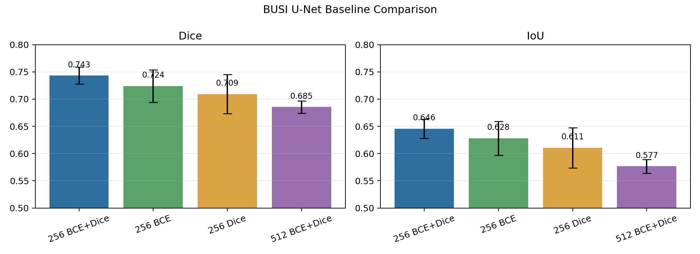

# BUSI U-Net 病灶分割四组实验分析报告

生成日期：2026-06-07

## 1. 实验设置概述

本阶段实验只使用 BUSI 数据集中的 `benign` 和 `malignant` 图像，任务为二值病灶区域分割。所有实验均采用基础 U-Net、5 折交叉验证、不加入数据增强，并以 Dice 和 IoU 作为主要评价指标。

本阶段完成的四组实验为：

| Experiment | Input | Loss | Batch Size | Epochs |
| --- | ---: | --- | ---: | ---: |
| `unet_256_bce_dice` | 256 x 256 | BCE + Dice | 32 | 50 |
| `unet_256_bce` | 256 x 256 | BCE Loss | 32 | 50 |
| `unet_256_dice` | 256 x 256 | Dice Loss | 32 | 50 |
| `unet_512_bce_dice` | 512 x 512 | BCE + Dice | 8 | 50 |



## 2. 总体结果

| Experiment | Dice mean +/- std | IoU mean +/- std | Rank |
| --- | ---: | ---: | ---: |
| `unet_256_bce_dice` | 0.7431 +/- 0.0155 | 0.6457 +/- 0.0176 | 1 |
| `unet_256_bce` | 0.7240 +/- 0.0296 | 0.6281 +/- 0.0309 | 2 |
| `unet_256_dice` | 0.7093 +/- 0.0359 | 0.6107 +/- 0.0368 | 3 |
| `unet_512_bce_dice` | 0.6854 +/- 0.0113 | 0.5768 +/- 0.0127 | 4 |

主要结论：

- `unet_256_bce_dice` 是当前最佳 baseline，Dice 和 IoU 均为四组最高。
- `unet_256_bce` 排名第二，说明纯 BCE 在本任务上并非完全失效，但稳定性弱于 BCE+Dice。
- `unet_256_dice` 均值低于 BCE 和 BCE+Dice，且 fold 间波动最大。
- `unet_512_bce_dice` 没有因为更高分辨率获得提升，反而 Dice 和 IoU 最低。

## 3. 每折表现与稳定性

| Experiment | Fold Dice values | Dice range | Best epoch pattern |
| --- | --- | ---: | --- |
| `unet_256_bce_dice` | 0.7392, 0.7157, 0.7462, 0.7606, 0.7540 | 0.0449 | 多数 fold 在 28-41 epoch 达到最佳 |
| `unet_256_bce` | 0.7235, 0.6673, 0.7465, 0.7472, 0.7353 | 0.0799 | 更依赖后期训练，多个 fold 在 43-50 epoch 达到最佳 |
| `unet_256_dice` | 0.6535, 0.6794, 0.7365, 0.7366, 0.7404 | 0.0869 | 前两个 fold 明显偏低，整体波动最大 |
| `unet_512_bce_dice` | 0.6818, 0.6666, 0.6850, 0.6948, 0.6989 | 0.0323 | fold 间最稳定，但稳定在较低水平 |

稳定性上，`unet_512_bce_dice` 的标准差最小，但这是“低均值下的稳定”，不能视为更优模型。`unet_256_bce_dice` 在均值最高的同时标准差也较小，是当前更可靠的 baseline。

## 4. Loss 对比分析

在同样 256 x 256 输入下，三种 loss 的排序为：

```text
BCE + Dice > BCE > Dice
```

`BCE + Dice` 相比纯 Dice：

- Dice 提升约 0.0339
- IoU 提升约 0.0350
- fold 间标准差更低

这说明组合损失更适合当前 BUSI 病灶分割 baseline。BCE 提供像素级监督，有助于训练早期稳定收敛；Dice 项直接优化前景区域重叠，能缓解病灶区域占比小带来的类别不均衡问题。

纯 BCE 的结果排在第二，但 best epoch 普遍偏后，说明它需要更长训练才能学到较好的前景区域。纯 Dice 的两个低分 fold 拉低了整体均值，提示 Dice Loss 单独使用时对初始化、fold 分布或小病灶样本更敏感。

## 5. 输入尺寸对比分析

`512 x 512 BCE+Dice` 明显低于 `256 x 256 BCE+Dice`：

- Dice 下降约 0.0577
- IoU 下降约 0.0689

这说明在当前训练设定下，提高输入尺寸并没有直接带来收益。可能原因包括：

- BUSI 超声图像包含较多 speckle noise，512 输入保留了更多噪声细节。
- 512 实验 batch size 从 32 降到 8，BatchNorm 统计更不稳定。
- 当前没有数据增强，高分辨率模型更容易对训练 fold 的局部纹理过拟合。
- 512 使用了与 256 相同的学习率和 epoch，没有单独调参。
- 基础 U-Net 的感受野和正则化能力有限，不一定能有效利用更高分辨率。

因此，当前不建议把 512 作为主 baseline。若后续继续探索 512，应配合更强数据增强、归一化/正则化策略或更适合小 batch 的归一化层。

## 6. 当前推荐结论

当前阶段推荐将 `unet_256_bce_dice` 作为 BUSI 病灶分割基础 baseline：

```text
Dice: 0.7431 +/- 0.0155
IoU:  0.6457 +/- 0.0176
```

该实验在均值、IoU 和稳定性之间取得了最好的平衡，也最适合作为后续 U-Net 改进模型的对照基线。

## 7. 局限性

- 当前只做图像级 5 折划分，BUSI 文件名不提供可靠患者 ID，因此不能声称患者级划分。
- 当前没有单独 test set，结果是 cross-validation validation 性能。
- 当前未加入数据增强，模型泛化能力可能被低估或不稳定。
- 当前指标为整体 Dice/IoU，尚未分别统计 benign 和 malignant 的分割表现。
- 当前只保存少量 fold 0 可视化示例，尚未做失败案例系统分析。

## 8. 下一步建议

优先级建议如下：

1. 以 `unet_256_bce_dice` 为主 baseline，加入轻量医学图像增强：水平翻转、小角度旋转、轻微平移缩放、亮度/对比度扰动。
2. 增加按类别的 Dice/IoU，分别观察 benign 和 malignant 病灶是否存在系统差异。
3. 做失败案例分析，抽取每折 Dice 最低的样本，观察漏分割、过分割和边界偏差。
4. 在 256 输入下复现改进模型，例如 Attention U-Net、U-Net++、ResUNet，再和当前 baseline 对比。
5. 若继续尝试 512 输入，建议使用 GroupNorm/InstanceNorm、降低学习率或加入更强增强，而不是直接复用当前 256 配置。
